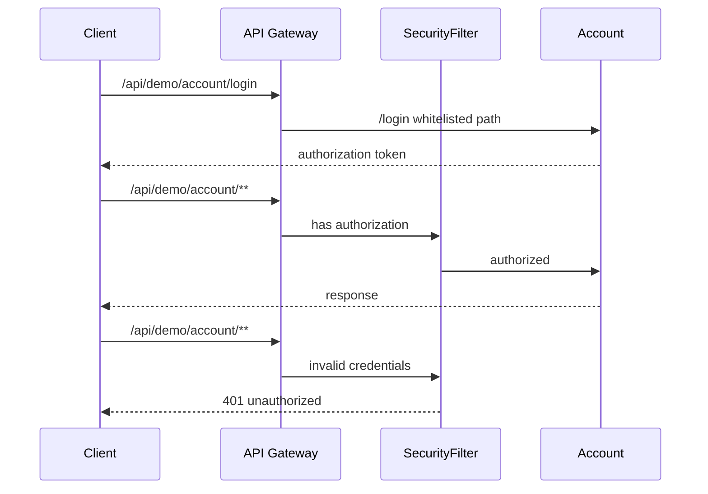

# About
A demo app using spring cloud gateway with spring security.

- The demo has security applied to all the endpoints except whitelisted ones configured at `application.yml`.
- The `/login` is whitelisted and proxied to `demo-account` project to generate a basic jwt token to illustrate authentication/authorization flow.
- Method security is applied to `demo-account` `/api/account/admin` endpoint using the `@PreAuthorize` annotation as an example of authorization.

## Author
- **David Teles** - david.ds.teles@gmail.com

## Flow
The security flow is illustrated below:

